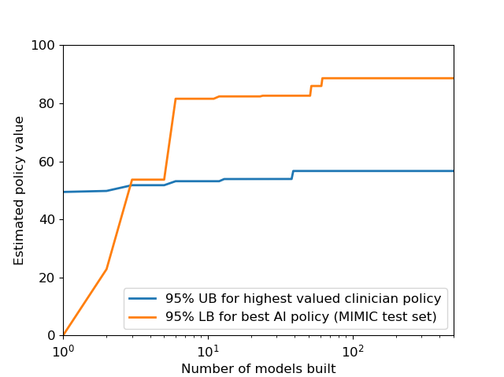
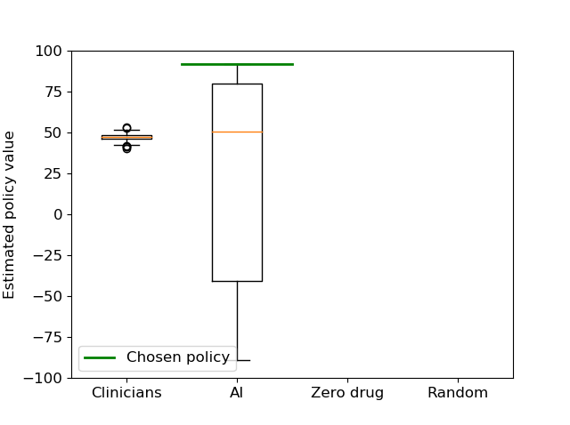
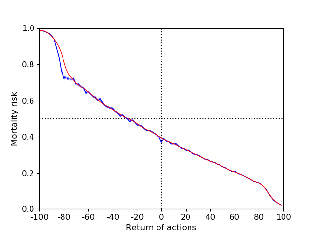
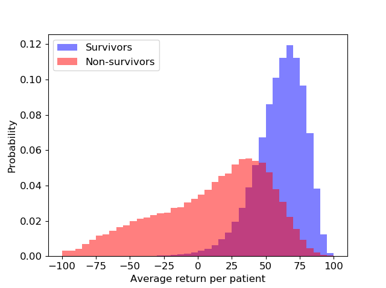

## Python Reimplementation of AI Clinician in Matlab 
The goal of this project is to provide python implementation of recent Nature Medicine paper by Komorowski et al. [1]. 

Komorowski et al., "The Artificial Intelligence Clinician learns optimal treatment strategies for sepsis in intensive care", Nature Medicine, 2018,  https://www.nature.com/articles/s41591-018-0213-5. 

The original codes were written in matlab and rewritten in Python in this project. You can acess to their original code from author's github page (https://github.com/matthieukomorowski/AI_Clinician) or follwoing gitlab page (https://gitlab.doc.ic.ac.uk/AIClinician/AIClinician). In this work, the reference matlab implementation was from the author's github page. 

In addition to the nature paper, you can find anonther work on sepsis and reinforcement learning. Because it's based on python implemention, you can also refer the following work.  

- Deep Reinforcement Learning for Sepsis Treatment
  - https://arxiv.org/abs/1711.09602
  - https://github.com/aniruddhraghu/sepsisrl 

### Requirement
1. Numpy (>=1.15.0) for 'stable' option for np.argsort() 

### Step Zero  
1. You need to get acess MIMIC III dataset (in our reimplemtation, ver 1.4 was used but the original nature medicine paper used ver 1.3) from https://mimic.physionet.org/. To get the dataset, you need to satisfy requirements from the webiste (take an online course and get approval from the manager). The MIMIC dataset is about 6G (compressed). 
2. You need to install Postgres database and create MIMIC database follwoing the instructions on physionet. For example, in windows operating system, you can follow this page (https://mimic.physionet.org/tutorials/install-mimic-locally-windows/). 

### Step One (Data Extraction)
1. In this stage, please run jupyter notebook and open the 'AIClinician_Data_extract_MIMIC3_140219.ipynb'
2. This notebook was originally from the author's github page and slightly modified by me. If this notebook is not working for you, please use the author's original one. 
3. 'elixhauser-quan.sql' file (from https://github.com/MIT-LCP/mimic-code/blob/master/concepts/comorbidity/elixhauser-quan.sql) was included for your convinience. 
4. After this step, you will get 24 csv files (about 2.7GB). They're stored in 'd:\exportdir' 

### Step Two (Define Sepsis Cohort)
1. From this step, the original codes were written in matlab. If you want to run the matlab codes, you need Matlab and Matlab Toolboxes (Bioinformatics, Optimization, Parallel Computing, Statistics and Machine Learning and Curve Fitting). 

2. This step reimplemted https://github.com/matthieukomorowski/AI_Clinician/blob/master/AIClinician_sepsis3_def_160219.m 
2. Please open/run 'sepsis_def.ipynb' or run 'python sepsis_def.py'. For your convinience, the 'reference_matrices.mat' file was included (from the author's github page). 
3. After this step, you will get 'sepsis_mimiciii.csv' and pickle file to be used in the next step (about 2.7G). 

### Step Three (Create MIMIC III Dataset)
1. This step reimplemented https://github.com/matthieukomorowski/AI_Clinician/blob/master/AIClinician_mimic3_dataset_160219.m
2. Please open/run 'mimic3_dataset.ipynb' or run 'python mimic3_datset.py' 
3. After this step, you will get 'mimictable.csv' and pickle file for the next step. 

### Step Four (Run Reinforcement Learning Algorithms) 
1. This step reimplemented https://github.com/matthieukomorowski/AI_Clinician/blob/master/AIClinician_core_160219.m
2. To replace MDP toolbox from Matlab, the PyMDPToolbox (https://pymdptoolbox.readthedocs.io/) was included. 
3. Please open/run 'Core.ipynb' or run 'python Core.py' 
4. This step uses parallelization for speed up. For example, Clustering and Policy Evaluation were implemetned with multiprocessing module. 
5. After this step, you will get bestpol.pkl (best policy found so far), recqvi.pkl (statistics of experiments), and recqvi.csv files (same data but in csv format). 
6. With 6 core cpu, it takes about 10 min per each iteration. 

### Step Five (Visualize Figures)
1. This step reimplemented https://github.com/matthieukomorowski/AI_Clinician/blob/master/AIClinician_core_160219.m
2. Please open/run 'Core_Visualize.ipynb' or run 'python Core_Visualize.py'
3. Figure 2(C) takes much time to get results. 
4. We got the folllwing figures   

 

 

### Future Works 
1. In this work, eICU dataset was not considered. Some related codes were not translated into Python. 
